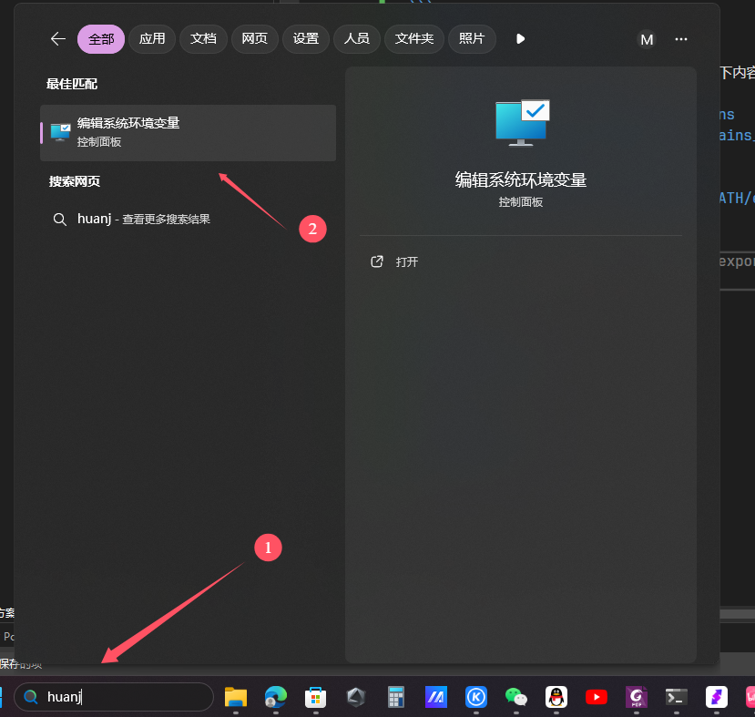
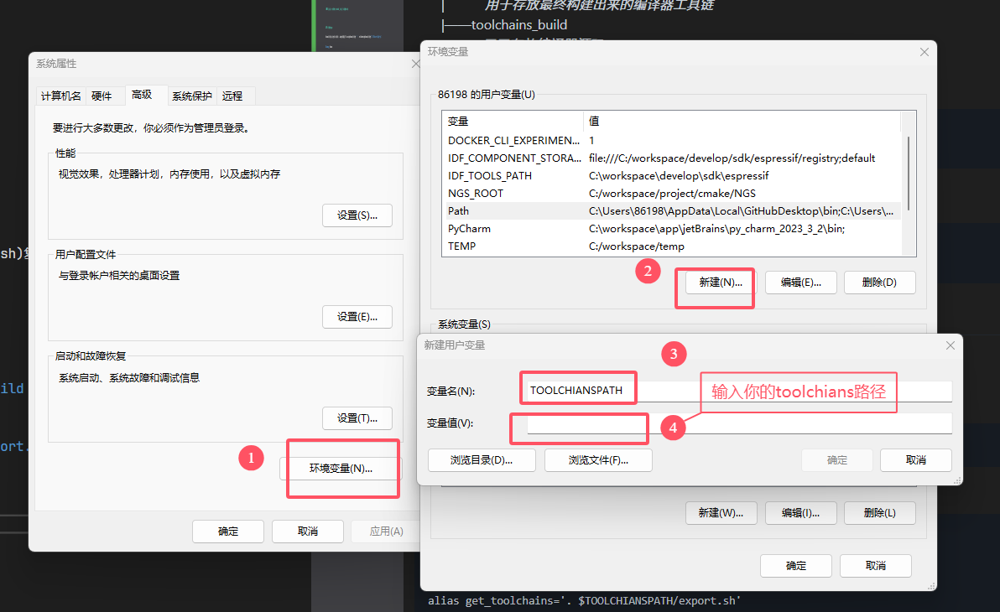

# 基本环境
本教程为接下来操作的基本环境，往后教程若无特殊指明，否则都会假定在此环境下进行

## 运行环境:
linux(笔者是wsl arch linux + win11)  

### 注意：全程禁止sudo, 除了下载软件包

## 目录结构：  
home目录可以为任何目录，本教程假定linux的home目录为`~`，windows的home目录为`C:\Users\用户名`  
&emsp;home  
&emsp;&emsp;|——toolchains  
&emsp;&emsp;|&emsp;&emsp;&emsp;*用于存放最终构建出来的编译器工具链*  
&emsp;&emsp;|——toolchains_build   
&emsp;&emsp;&emsp;&emsp;&emsp;*用于存放编译器源码*  

### linux
```shell
cd ~
mkdir -p toolchains toolchains_build
```
### windows
```powershell
cd C:Users\用户名
mkdir toolchains toolchains_build
```
## 环境变量：  
### linux
将我们的[环境变量导出脚本](../../script/export.sh)复制到`toolchains`目录下：  
```shell
cp export.sh ~/toolchains
```
编辑`~/.bashrc`或`~/.zshrc`文件，添加如下内容：
```shell
export TOOLCHIANSPATH=$HOME/toolchains
export TOOLCHAINS_BUILD=$HOME/toolchains_build

# 起一个别名，方便我们快速导入工具链
alias get_toolchains='. $TOOLCHIANSPATH/export.sh'
```
### windows
  
  

## 源： 
ubuntu
```shell
sudo apt update
```
arch linux
```shell
sudo pacman -Sy
```