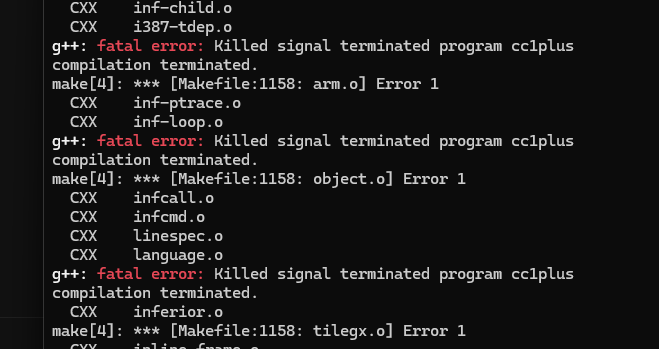

# 构建 gcc本地编译器
构建 gcc本地编译器

## 构建前准备
我们的目录结构为：  
&emsp;home  
&emsp;&emsp;|——toolchains  
&emsp;&emsp;|&emsp;&emsp;&emsp;*用于存放最终构建出来的编译器工具链*  
&emsp;&emsp;|——toolchains_build   
&emsp;&emsp;&emsp;&emsp;&emsp;*用于存放编译器源码*  

运行环境为 linux  
**注意：全程禁止sudo, 除了下载软件包**

```shell
cd ~
mkdir -p toolchains toolchains_build
```
将我们的[环境变量导出脚本](../../script/export.sh)复制到`toolchains`目录下：  
```shell
cp export.sh ~/toolchains
```
编辑`~/.bashrc`或`~/.zshrc`文件，添加如下内容：
```shell
export TOOLCHIANSPATH=$HOME/toolchains
export TOOLCHAINS_BUILD=$HOME/toolchains_build

# 起一个别名，方便我们快速导入工具链
alias get_toolchains='. $TOOLCHIANSPATH/export.sh'
```
更新源  
ubuntu
```shell
sudo apt update
```
arch linux
```shell
sudo pacman -Sy
```
## 构建gcc本地编译器 
### 思路
编译gcc往往直接构建就行了（可能会有缺包问题，参考下文的`下载依赖`）  
如果想全面更新工具链，可以用老版本gcc构建新版本gcc，再编译binutils-gdb，得到新版本的binutils-gdb，之后再编译一遍gcc，得到新版本的gcc。
这样就可以得到一个全新的工具链了。  
具体流程如下：   
&emsp;&emsp;**老版本gcc -> 中间版gcc -> 新版binutils-gdb -> 新版gcc**
### 实践
下载依赖
```shell
# ubuntu
sudo apt install build-essential bison flex texinfo gcc
# arch linux
sudo pacman -S base-devel bison flex texinfo gcc
```
克隆gcc源码
```shell
cd $TOOLCHAINS_BUILD
git clone git://gcc.gnu.org/git/gcc.git
```
准备gcc依赖
```shell
cd gcc
./contrib/download_prerequisites
```
克隆binutils-gdb源码
```shell
cd $TOOLCHAINS_BUILD
git clone https://sourceware.org/git/binutils-gdb.git
```
把刚刚gcc下载的依赖链接到binutils-gdb
```shell
cd $TOOLCHAINS_BUILD/binutils-gdb
ln -s ../gcc/gmp gmp
ln -s ../gcc/mpfr mpfr
ln -s ../gcc/mpc mpc
ln -s ../gcc/isl isl
ln -s ../gcc/gettext gettext
```
创建构建目标目录 
```shell
mkdir -p $TOOLCHIANS_BUILD/build/x86_64-pc-linux-gnu/x86_64-pc-linux-gnu
cd $TOOLCHIANS_BUILD/build/x86_64-pc-linux-gnu/x86_64-pc-linux-gnu
mkdir binutils-gdb gcc
```
构建binutils-gdb
```shell
cd $TOOLCHIANS_BUILD/build/x86_64-pc-linux-gnu/x86_64-pc-linux-gnu/binutils-gdb
$TOOLCHIANS_BUILD/binutils-gdb/configure \
	--prefix=$TOOLCHAINSPATH/x86_64-pc-linux-gnu/x86_64-pc-linux-gnu \
	--disable-nls \
	--disable-werror \
	--enable-gold \
	--with-python3

make -j$(nproc) # 选择合适的线程数，不如会编译错误
make install-strip -j
```


验证一下binutils-gdb是否构建成功
```shell
which gdb # $TOOLCHAINSPATH/x86_64-pc-linux-gnu/x86_64-pc-linux-gnu/bin/gdb
which ar # $TOOLCHAINSPATH/x86_64-pc-linux-gnu/x86_64-pc-linux-gnu/bin/ar
which objdump # $TOOLCHAINSPATH/x86_64-pc-linux-gnu/x86_64-pc-linux-gnu/bin/objdump
```
构建gcc
```shell
cd $TOOLCHIANS_BUILD/build/x86_64-pc-linux-gnu/x86_64-pc-linux-gnu/gcc
$TOOLCHIANS_BUILD/gcc/configure \
	--prefix=$TOOLCHAINSPATH/x86_64-pc-linux-gnu/x86_64-pc-linux-gnu \
	--disable-nls \
	--disable-werror \
	--disable-bootstrap \
	--enable-languages=c,c++ \
	--disable-multilib \
	--disable-libstdcxx-verbose
# binutils-gdb依赖解决了，gcc就大概率没问题
# 可能有问题的是linux头文件有可能没装
make -j$(nproc)
make install-strip -j
```
之前我们写的环境变量导出脚本就派上用场了，我们导入一下工具链
```shell
get_toolchains
```
验证一下gcc是否构建成功
```shell
g++ -v
# Using built-in specs.
# COLLECT_GCC=g++
# COLLECT_LTO_WRAPPER=/home/nagisa/toolchains/x86_64-pc-linux-gnu/x86_64-pc-linux-gnu/libexec/gcc/x86_64-pc-linux-gnu/15.0.0/lto-wrapper
# Target: x86_64-pc-linux-gnu
# Configured with: /home/nagisa/toolchains_build/gcc/configure --prefix=/home/nagisa/toolchains/x86_64-pc-linux-gnu/x86_64-pc-linux-gnu --disable-nls --disable-werror --disable-bootstrap --enable-languages=c,c++ --disable-multilib --disable-libstdcxx-verbose
# Thread model: posix
# Supported LTO compression algorithms: zlib zstd
# gcc version 15.0.0 20240825 (experimental) (GCC)

which g++ # $TOOLCHAINSPATH/x86_64-pc-linux-gnu/x86_64-pc-linux-gnu/bin/g++
```
因为构建出来的gcc版本较新，所以像老版本依赖的cc在bin中是没有的，我们要手动创建一个软链接
```shell
cd $TOOLCHAINSPATH/x86_64-pc-linux-gnu/x86_64-pc-linux-gnu/bin
ln -s gcc cc
```
编译个[helloworld.cpp](../../script/helloworld.cpp)试试效果
```shell
cp helloworld.cpp ~
cd ~
g++ helloworld.cpp -std=c++26
./a.out # hello world!
ldd ./a.out
# 输出
# linux-vdso.so.1 (0x00007fffd85f5000)
# libstdc++.so.6 => /home/nagisa/toolchains/x86_64-pc-linux-gnu/x86_64-pc-linux-gnu/lib64/libstdc++.so.6 (0x00007f7e41bbe000)
# libm.so.6 => /lib/x86_64-linux-gnu/libm.so.6 (0x00007f7e41acf000)
# libgcc_s.so.1 => /home/nagisa/toolchains/x86_64-pc-linux-gnu/x86_64-pc-linux-gnu/lib64/libgcc_s.so.1 (0x00007f7e41aa1000)
# libc.so.6 => /lib/x86_64-linux-gnu/libc.so.6 (0x00007f7e4188f000)
# /lib64/ld-linux-x86-64.so.2 (0x00007f7e41e31000)
# 动态库链接上最新的了
```