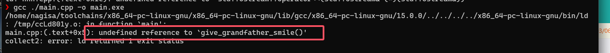
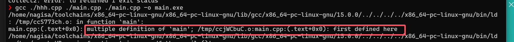

# c/c++ 中的编译

> 注意： 此篇文章有一定难度，可能需要初学者多次阅读

在文章开始前，让我们先体验一下编译链接的过程  

先写个main.cpp和hhh.cpp程序  
```cpp
//main.cpp

void give_grandfather_a_smile();

int main()
{
	::give_grandfather_a_smile();
	return 0;
}
```
```cpp
//hhh.cpp
#include <iostream>

void give_grandfather_a_smile()
{
	::std::cout << "hhhhhhhhh xswl" << ::std::endl;
}
```
在控制台中输入`g++ hhh.cpp main.cpp -o main.exe`，回车  
> 其中`g++`是`gnu`的c++编译器，`hhh.cpp` `main.cpp`是源文件，`-o`是指定输出文件名，`main.exe`是输出文件名  

输出hello world!  
  

想要了解我们的源代码`hhh.cpp`，`main.cpp`是怎么到`main.exe`的，就得先知道什么是编译链接  

## 编译链接

> 参考 [翻译阶段](https://zh.cppreference.com/w/cpp/language/translation_phases)

### 编译
机器是只看的懂二进制码的，而写二进制码对人类来说有点麻烦，所以人类可以用`高级语言`来写代码(也就是我们的c,c++)，再将代码翻译成`机器码`  

**而将`高级语言`翻译成`机器码`的过程就是`编译`**  
编译时会
1. 预处理源文件
2. 检查语法错误
3. 生成中间代码
4. 优化代码
5. 生成符号表

### 链接

对于c/c++语言来说，允许存在多个`翻译单元`（可以简单理解成 .c/.cpp 文件）  
> 这些个`翻译单元`可以负责不同的功能，比如一个负责`输入输出`，一个负责`数学运算`，一个负责`逻辑运算` 

编译会将这些个`翻译单元` **分别** **独立** 编译成`中间文件`，之后再将这多个`中间文件`连接起来，生成最后的`可执行文件`（windows上就是.exe后缀的文件）  

**而将`中间文件`连接起来的过程就是`链接`**  

链接时会  
1. 收集各个中间文件的符号表
2. 重定位未定义符号（将一个中间文件的未定义符号链接到其他中间文件的已定义的符号)
3. 检查是否存在未定义符号，重定义符号
4. 优化代码
5. 生成可执行文件

---
### 我们再回过头来看上述例子编译器和链接器都干了什么  

hhh.cpp 和 main.cpp 对应着两个`翻译单元`，所以编译器要**分别** **独立**地编译两者（也就是顺序无关的）

* 编译 main.cpp：  
&emsp;&emsp;1. 预处理 main.cpp(没有任何要预处理的内容)  
&emsp;&emsp;2. 检查 main.cpp 是否有语法错误（有就报编译错误）  
&emsp;&emsp;3. 生成中间代码 (main.o)  
&emsp;&emsp;4. 生成符号表，发现了`int main()`和`void give_grandfather_a_smile()`这两个符号，其中`int main()`是已定义的符号，而`void give_grandfather_a_smile()`是未定义的符号  
* 编译 hhh.cpp：  
&emsp;&emsp;1. 预处理 hhh.cpp。将`#include`展开（文本替换）  
&emsp;&emsp;2. 检查 hhh.cpp 是否有语法错误 （很显然没有）  
&emsp;&emsp;3. 生成中间代码(hhh.o)  
&emsp;&emsp;4. 生成符号表，发现了`void give_grandfather_a_smile()`这个已定义的符号
* 链接 main.o hhh.o  
&emsp;&emsp;1. 收集 main.o 和 hhh.o的符号表（main.o hhh.o符号表对应内容见上述编译）  
&emsp;&emsp;2. 发现 main.o 中有一个未定义符号`void give_grandfather_a_smile()`，而这个符号又在 hhh.o 中出现并定义，所以重定位 main.o 中的符号到 hhh.o  
&emsp;&emsp;3. 检查是否还存在 未定义符号 和 重定义符号（很显然没有）  
&emsp;&emsp;4. 生成 main.exe 可执行文件  

> 注意： 在命令行中，`编译`和`链接`合成了一个操作，g++这时候又担任编译器的角色, 又担任链接器的角色  

### 那要是单独编译 main.cpp，而不链接 hhh.cpp 会怎样？  
会报符号错误  
当进行到链接步骤时，链接器发现 main.cpp 存在一个未定义的符号（`void give_grandfather_a_smile()`），就给你报`符号未定义`的错误  


### 那要是链接两遍 main.cpp 会怎样？  
会报符号重定义错误  
当进行到链接步骤时，链接器发现存在两个`void main()`函数的定义，符号重定义了，所以报重定义错误  


## 头文件是什么

相信你也注意到了，在编译阶段，源文件并不需要一个函数的定义，只需要一个函数的声明即可成功编译    
> 在 main.cpp 中 `void give_grandfather_a_smile()`这个声明就够了，而`void give_grandfather_a_smile()`的定义在其他翻译单元（hhh.cpp）中

这对我们将不同功能的代码放在不同的源文件中是很有用的（利于模块化代码）  

但我们这操作方式可能会有点问题，假如我们多加一个源文件，比如 xswl.cpp  
```cpp
//xswl.cpp

// 需要再写一遍函数声明
void give_grandfather_a_smile();

void xswl()
{
	::give_grandfather_a_smile();
}

```
这个xswl.cpp也引用了`void give_grandfather_a_smile()`这个符号，我们得把`void give_grandfather_a_smile();`这个声明再写一遍  

所以呢？  

加入我们有一百个.cpp文件，都引用了这个符号，我们得把`void give_grandfather_a_smile();`这个声明写一百遍？  
且不说目前还只有 hhh.cpp 中只有一个符号，如果有多个符号，那不是要写很多遍？  

所以我们可以用`头文件`来解决这个问题，让我们重新编写 hhh 模块， 这回我们写两个文件: hhh.h hhh.cpp  

```cpp
// hhh.h

void give_grandfather_a_smile();
void give_grandmother_a_smile();
void give_me_a_smile();

```
```cpp
// hhh.cpp
#include <iostream>
#include "hhh.h"

void give_grandfather_a_smile()
{
	::std::cout << "hhhhhhhhh xswl" << ::std::endl;
}
void give_grandmother_a_smile()
{
	::std::cout << "hhhhhhhhhhhhhhhhhhhhhhhhhhhhhhhhhhhhh" << ::std::endl;
}
void give_me_a_smile()
{
	::std::cout << "114514" << ::std::endl;
}

```
> 这里的`#include`分别用了 尖括号 和 双引号，关于他们的区别见 [源文件包含](https://zh.cppreference.com/w/cpp/preprocessor/include)  

> 头文件 一般并不直接作为 翻译单元（略有歧义，初学者暂时这么理解）  

hhh.h 中提供函数声明， 而在 hhh.cpp 中提供了对应函数的定义  
这样我们在其他源文件中只需要`#include "hhh.h"`就可以使用 hhh 模块提供的函数了  
例如：  
```cpp
// main.cpp
#include "hhh.h"

int main()
{
	::give_grandfather_a_smile();
	::give_grandmother_a_smile();
	::give_me_a_smile();
	return 0;
}
```
> `#include`指令是预处理指令，只会做简单的文本替换（复制 hhh.h 中的内容，粘贴到 main.cpp 中）

这时候，hhh.h 就叫 `头文件`  

### 标准头

c的标准头有：stdio.h, stdlib.h, string.h, math.h... 等等  

c++的标准头有： iostream, string, vector, algorithm... 等等
> 可以注意到c++的头文件没有后缀名

c++为c语言的标准头提供了兼容标头，比如 c\++ 的 cstdio 对应 c 的 stdio.h  
> 主要是添加了命名空间，以及一些c++特有的功能，见[标准库标头](https://zh.cppreference.com/w/cpp/header)


## 构建工具  

当写大型项目时，所有的源文件可就不止这么点了， 你的源文件可能有这奇奇怪怪的名字，在奇奇怪怪的目录下，还有着各种各样的配置，头文件目录也在各种地方  

这时候如果还在命令行一个一个慢慢敲，慢慢写你的源文件在哪，头文件目录在哪，那得累死人了  

**于是我们可以依赖构建工具，我们只需要告诉构建工具我们的源文件在哪，头文件在哪，他就会帮我们自动生成指令，自动编译链接**  

> 很可惜，c/c++没有一个很好用的构建工具

以下列举常用的构建工具，以及他们的优劣：  
* Makefile 适合快速构建小项目；但构建大型项目时心智负担会很重
* cmake 适合构建大型项目，跨平台；语法极其复杂，学习成本高，文档烂，构建速度慢  
* xmake 适合构建大小型，常规项目，跨平台，语法简单，学习成本低，文档好，构建速度快；在有着极强的自定义要求时，xmake就容易变得极其复杂，甚至不如直接写makefile
* msbuild visual studio专用构建器，适合构建windows平台的项目，构建速度快，学习成本低（对着ui点点点）；不跨平台（只能构建windows平台的项目），而且不支持脚本构建

> 其实写c++的人真正想要的还是个有着c\++语法的构建工具

