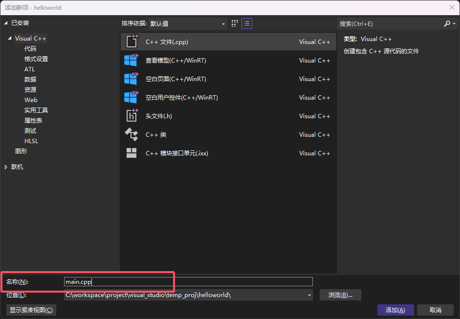
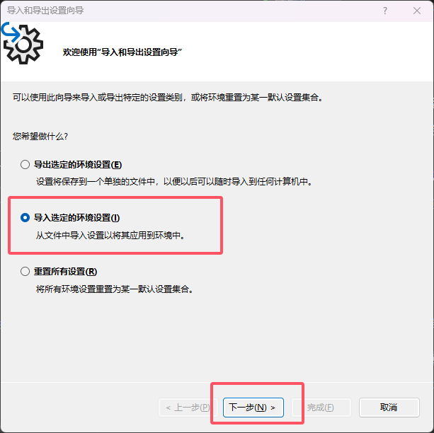

# visual studio 环境搭建

## 获取

[官网下载](https://visualstudio.microsoft.com/zh-hans/)  

  
这会下载一个`VisualStudioSetup.exe`文件，打开后是`visual studio installer`，也就是安装器  
> vs的下载都是通过visual studio installer来下载的，你可以在上面下到visual studio的各种版本  

点进去后如图  

  
（我这已经下载了）  

## 安装

我们要下载的版本是`visual studio community 2022`，`community`是因为是免费的，`2022`是因为是最新的版本
> 如果你更激进点可以下载`visual studio community 2022 preview`（就是我这版本）
ide可以挑着最新的下，提供的功能多，跟得上时代

点击`安装`，然后会出现如图    
  
对于大部分人来说（尤其是新手），勾选`使用C++的桌面开发`就够了

安装位置可以自定义  
  
笔者建议电脑不要分盘，一切都装在c盘  

之后点击下载就行了，vs下载会比较久

## msbuild

msbuild是vs的构建工具，同级别的有如`Makefile`，`xmake`等  
关于什么是构建工具，可以看[这里](../ccpp编译/main.md)  
此篇文章主要介绍vs的项目工程组织结构

### vs的项目工程为：  
&emsp;&emsp;解决方案(.sln文件)  
&emsp;&emsp;&emsp;&emsp;项目(.vcxproj文件)  
&emsp;&emsp;&emsp;&emsp;项目(.vcxproj文件)  
&emsp;&emsp;&emsp;&emsp;项目(.vcxproj文件)  
&emsp;&emsp;&emsp;&emsp;...

### 比如我可以：  
&emsp;&emsp;算法练习题(.sln文件)  
&emsp;&emsp;&emsp;&emsp;快速排序算法(.vcxproj文件)  
&emsp;&emsp;&emsp;&emsp;斐波那契数列(.vcxproj文件)  
&emsp;&emsp;&emsp;&emsp;二叉树(.vcxproj文件)  
&emsp;&emsp;&emsp;&emsp;...

## 使用

### 创建项目

启动vs，会看到启动界面  
  
我们选择`创建新项目`
> 这里的创建新项目就对应着上文所说的`项目(.vcxproj)`，`解决方案(.sln)`会在新项目创建时自动生成

  
语言选择`c++`，平台选择`windows`，创建`空项目`，点击下一步  

  
注意这里的`项目名称`，`解决方案名称`，参考`msbuild`  

我们给解决方案起名`temp_proj`，项目起名`helloworld`，点击创建  
  

对应的文件夹结果如图：   
  

> 注意：vs默认的项目是用的`虚拟文件夹`（过滤器），选中项目，点击这个按钮开启真实的`文件夹`  

  

删掉自动生成的`x64`文件夹，创建`main.cpp`，右键项目  
  
  

编写hello world，点击运行    
  

### 个性化（可选）

* 主题调成深色，浅色丑死了  

* 字体也可以调，推荐用我的配置文件  
> 在这里[下载](https://github.com/situNagisa/visual_studio/blob/main/nagisa_visual_studio_settings.vssettings);
可以直接克隆[github](git@github.com:situNagisa/visual_studio.git)

  
  
  
  
输入你刚刚下载的配置文件路径就行了  
