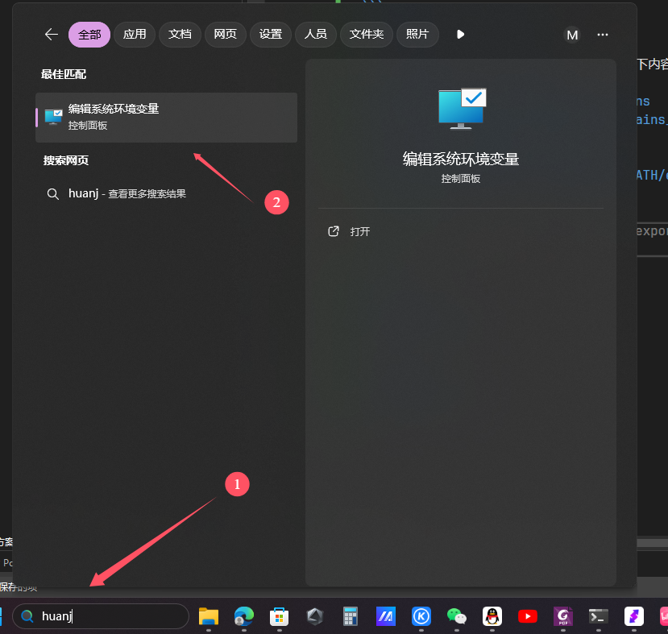

# visual studio code 环境搭建

visual studio code 的配置有一定门槛，如果你想知道每一步具体是在干什么，请先参阅 [c cpp 编译](../ccpp编译/main.md)  
当然你也可以无脑跟步骤走

## 获取

### visual studio code

vscode 可以在[vscode 官网](https://code.visualstudio.com/)下载的，你可以在上面下到vscode的各种版本

### mingw

除了vscode，还需要一个编译器，一般用的是`mingw`  

> mingw (读作"铭 记 达不溜")是将windows的c库包装成了 gcc 的调用，以便gcc在windows运行

* 你可以在[mingw 官网](https://sourceforge.net/projects/mingw-w64/)下载  
* 也可以下载别人编译好的[cqwrteur gcc-release](https://github.com/trcrsired/gcc-releases/releases/tag/20240721-x86_64-w64-mingw32)（大部分要下的都是`x86_64-w64-mingw32`）  
> 这前缀是什么意思可以参考[【科普】编译器的构建基本原理](https://zhuanlan.zhihu.com/p/553543765)，这里简单介绍一下，x86_64代表的是极其架构，你的电脑就是x86_64的，手机是arm的; w64代表 windows 64位操作系统，不用看了也是你的操作系统   
* 你也可以自己编译一个，参考[构建gcc加拿大编译器](../../cqwrteur课程/02构建gcc本地交叉加拿大编译器/main.md)
* 用笔者编译的[x86_64-w64-mingw32](../../../resource/x86_64-w64-mingw32.tar.xz)
> 笔者建议最低下个gcc 13，别用几百年前的版本

为了让我们能在命令行中直接调用gcc，我们需要将gcc的bin,lib,lib32目录添加进环境变量   
  
    
  
  
  

> 注意！！！ 这里有一个新手非常容易错的点 -- 路径名使用中文 空格等，这样有可能会导致路径解析问题的  
请确保你的路径信息中，所有文件夹都只由 大小写字母，下划线，数字组成（并且数字不能打头）  
这样可以解决你之后遇到的百分之九十奇奇怪怪的问题

crtl+r快捷键打开运行窗口，在里面输入powershell，回车打开powershell.exe  


输入g++ -v，如果有类似以下输出，那么就是配置成功了


> 如果你配置了环境变量，但是还是找不到g++，你可以尝试重启powershell

## 插件

vscode 默认是英文，想要中文得装个插件  


写c cpp也要个插件  
  

## 配置

找一个文件夹，用作c++工作目录，建立`.vscode`文件夹  
并在其下建立`c_cpp_properties.json`文件，将以下内容复制进去  
```json
{
  "configurations": [
    {
      "name": "linux-gcc-x64",
      "includePath": [
        "${workspaceFolder}/**",
        "${workspaceRoot}"
      ],
      "defines": [],
      "intelliSenseMode": "linux-gcc-x64",
      "browse": {
        "limitSymbolsToIncludedHeaders": true,
        "databaseFilename": "",
        "path": [
          "${workspaceRoot}"
        ]
      },
      "cStandard": "${default}",
      "cppStandard": "${default}",
      "compilerPath": "/usr/sbin/gcc"
    }
  ],
  "version": 4
}
````
> c_cpp_properties.json 并不直接参与编译链接过程，他是用于vscode的智能提示的（在你点编译前告诉你你的代码哪里有问题）

建立`tasks.json`文件，将以下内容复制进去  
```json
{
    "version": "0.2.0",
    "configurations": [
        {
            "name": "(Windows) Launch",
            "type": "cppdbg",
            "request": "launch",
            "program":  "${workspaceFolder}/${fileBasenameNoExtension}.exe",
            "preLaunchTask": "run",
            "args": [],
            "stopAtEntry": false,
            "cwd": "${workspaceFolder}",
            "environment": [],
            "externalConsole":false
        },
    ]
}
```
> task.json 是告诉vscode要如何编译链接你的程序的，以及程序生成在哪里

建立`launch.json`文件，将以下内容复制进去  
```json
{
    "version": "0.2.0",
    "configurations": [
        {
            "name": "(Windows) Launch",
            "type": "cppdbg",
            "request": "launch",
            "program":  "${workspaceFolder}/${fileBasenameNoExtension}.exe",
            "preLaunchTask": "run",
            "args": [],
            "stopAtEntry": false,
            "cwd": "${workspaceFolder}",
            "environment": [],
            "externalConsole":false
        },
    ]
}
```
> launch.json 告诉vscode你的程序在哪里，怎么运行

最终结构如图：(其他那些文件请忽略掉)  
  

## 使用

写一个hello world试试  


点开调试面板，开始运行  


成功！  


